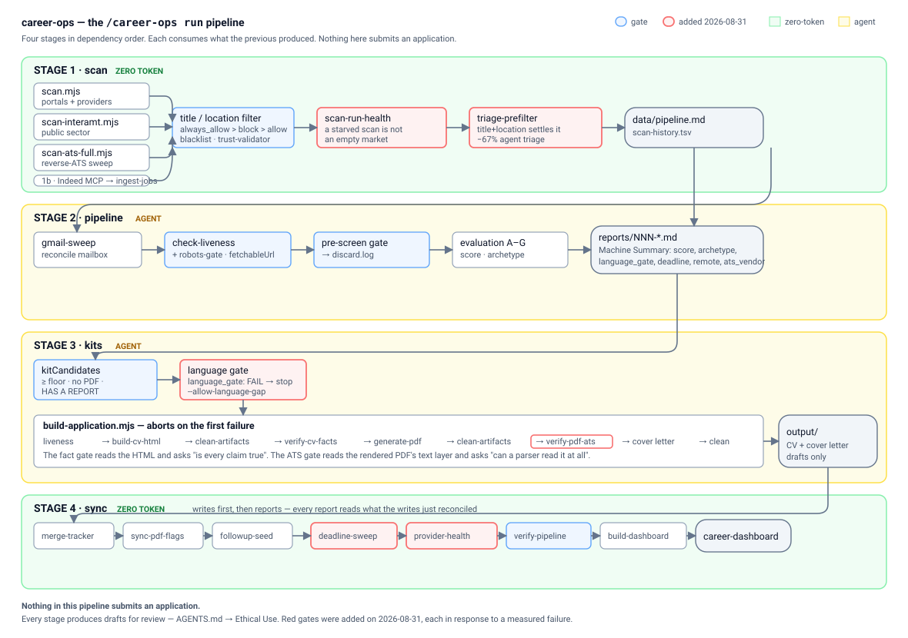
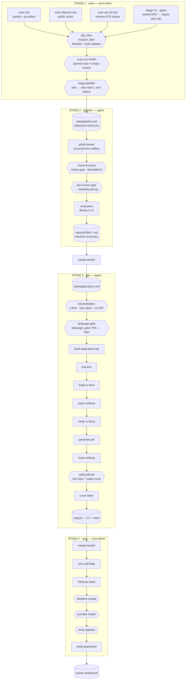

# The pipeline

What `/career-ops run` actually does, and where every gate sits.

Four stages, in dependency order. Each consumes what the one before produced —
the order is a data dependency, not a preference. Stages 1 and 4 cost **zero
tokens**; 2 and 3 need a model and are handed back to the agent with an explicit
contract.

## The gates, and what each one refuses

| Gate | Stage | Refuses |
|---|---|---|
| `title_filter` / `location_filter` | 1 | Wrong role, wrong place. `always_allow` > `block` > `allow`; outside the home and Munich regions, **remote only** |
| `blacklist` · `_trust-validator` | 1 | Do-not-apply employers; postings whose company and domain disagree |
| **`scan-run-health`** | 1 | Reasoning over a scan that was rate-limited rather than empty |
| **`triage-prefilter`** | 1 | Postings the title and location already settle — 67% of them, at zero token cost |
| `check-liveness` + **`robots-gate`** | 2 | Dead postings; and escalating to a browser UA against a site that declined in robots.txt |
| pre-screen | 2 | Anything below the pursue floor, logged to `discard.log` with its reason |
| `kitCandidates` | 3 | Rows with no report — there is nothing to tailor from, and building anyway is fabrication |
| **language gate** | 3 | A stated German requirement A2 cannot meet (`--allow-language-gap` overrides) |
| `verify-cv-facts` | 3 | Claims not supported by `cv.md` |
| **`verify-pdf-ats`** | 3 | A PDF an ATS parser cannot read, or one that ran to an extra page |

Bold entries were added on 2026-08-31 — each in response to a measured failure,
not a hypothetical one.

## What never happens here

**Nothing is submitted.** No form is filled, no message is sent, no Apply button
is clicked. Every stage produces drafts for review — `AGENTS.md` → Ethical Use.

## Analytics (all zero-token, all read-only)

| Script | Answers |
|---|---|
| `stats.mjs` | Lifetime funnel, scanner totals, portal coverage |
| `analyze-patterns.mjs` | Blockers, archetype conversion, per-vendor advance rate |
| `language-loss.mjs` | How much of the pipeline dies on German — the dominant blocker |
| `funnel-velocity.mjs` | Stage velocity, folded from `data/status-log.tsv` |
| `provider-health.mjs` | Scrapers returning junk without erroring |
| `deadline-sweep.mjs` | Postings past their own stated deadline — no fetch |
| `referral-links.mjs` | Search links for a row with no reachable contact |
